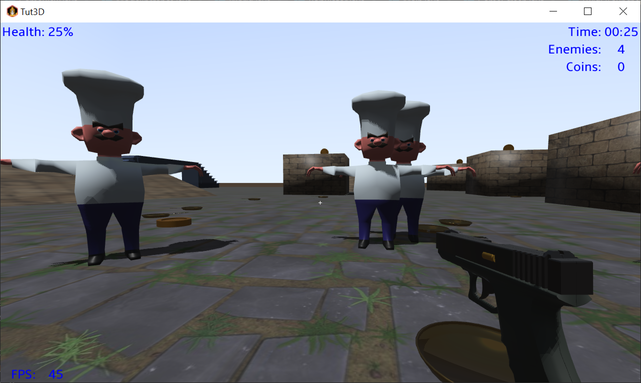

# Tut3D (update 2026)

This is the code repository for the [LibGDX 3D Tutorial](https://monstroussoftware.github.io/2023/11/01/Tutorial-3D-step1.html).
Use the releases or git tags to get the version corresponding to each step of the tutorial.

## Platforms

- `core`: Main module with the application logic shared by all platforms.
- `lwjgl3`: Primary desktop platform using LWJGL3; was called 'desktop' in older docs.
- `teavm`: web platform using TeaVM and WebGL. Only supported up to step 4 of the tutorial.
